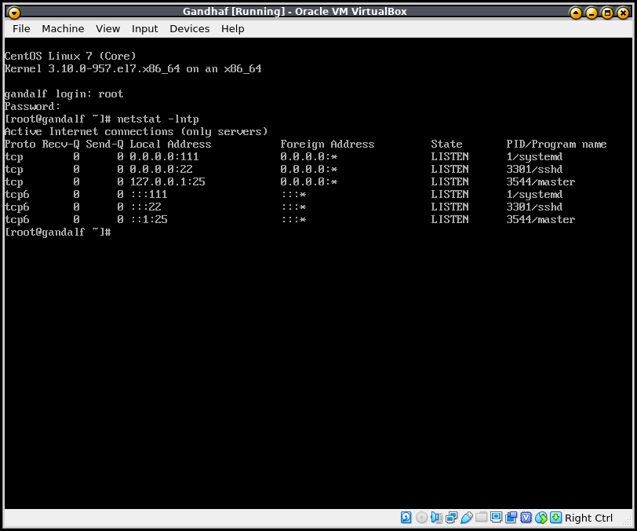

<!-- START doctoc generated TOC please keep comment here to allow auto update -->
<!-- DON'T EDIT THIS SECTION, INSTEAD RE-RUN doctoc TO UPDATE -->
**Table of Contents**  *generated with [DocToc](https://github.com/thlorenz/doctoc)*

- [Description](#description)
  - [Information :](#information-)
  - [Gandalf installation](#gandalf-installation)
  - [Bilbo installation](#bilbo-installation)
- [Atelier version plus compliqué](#atelier-version-plus-compliqu%C3%A9)
- [Objectif et critère de succès](#objectif-et-crit%C3%A8re-de-succ%C3%A8s)
  - [Objectif](#objectif)
  - [Critère de succès](#crit%C3%A8re-de-succ%C3%A8s)
- [Exemple du Résultat](#exemple-du-r%C3%A9sultat)

<!-- END doctoc generated TOC please keep comment here to allow auto update -->


# Description 

Bien entendu pour pouvoir jouer, il faut avoir un lieu, nous, heu non VOUS allez installer tous ça.
Pour la première tâche, nous allons faire l'installation des machines :

* VM ou serveur ; tour peut importe ; la machine qui servira de "server" 
    * hostname : Gandalf
    * Version de Linux : CentOs 7
* Laptop ; machine client ( optionel ) 
    * hostname : Bilbo
    * Version de Linux : Ubuntu ; dernière version disponible


Faire l'installation des 2 machines , configuration par défaut , libre à vous le mode d'installation :P. 

## Information :

* Temps requis : TODO ajouter le temps pris pour l'exercice
* Niveau : Débutant / explorateur 
* Pré requis : Avoir au moins une machine pour faire l'installation 

## Questions 

* Quelle sont les particularité des distributions ? 
* À quoi sert la partition swap ?

 
## Gandalf installation

Suggestion de configuration pour le serveur **Gandalf** , bien entendu moi je ne vais pas mettre d'interface graphique, cependant faite comme vous voulez, je le répète. L'objectif est d'avoir la possibilité d'explorer les possibilités et de réussir à mettre quelque chose en place peu importe le chemin trouvé. Vous voulez avoir une interface graphique pour votre serveur GO. Nous verrons par la suite.

* OS : **Centos 7**
* Type d'installation : **Infrastructure Server**
* Partitionnement : laissez par default
* Assignation du mot de passe root à votre convenance. 
* Assurez vous d'avoir une adresse IP fixe sur la machine, ceci est un "serveur", sinon vous serez obligé de chercher à chaque fois !

## Bilbo installation

Suggestion de configuration pour la station **Bilbo** , installé la total avec une belle interface graphique. L'objectif est de profité du côté utilisateur de linux desktop et de capitalisé sur cette machine pour jouer avec une distribution de type debian.


# Atelier version plus compliqué 

Suggestion pour compliquer le processus: 

* Faire l'installation du serveur **Gandhalf** en mode réseau, donc le CD ou clé USB n'a pas l'ensemble des packages mais uniquement le logiciel pour initialisé le processus d'installation et l'ensemble est sur internet.
* Faire une installation en mode Minimal.
* Faire des partitions pour le serveur **Gandhalf** : 
    * /data : avec beaucoup d'espace pour des fichiers
    * /tmp : avec 4 gig 
    * Swap : a votre convenance genre 4 gig
    * / : le reste 


# Objectif et critère de succès 

## Objectif 

* Parcourir le mode d'installation de 2 type de distribution Linux Redhat (CentOS) et Debian (Ubuntu).
* Faire les recherches sur internet des problèmes ou interrogation lors du processus 

## Critère de succès 

1. Avoir les 2 machines qui démarre sous Linux. (Une si juste le serveur)
2. Avoir un compte utilisateur vous permettant de vous y connecter, ce compte peut être l'utilisateur **root** ou un autre utilisateur avec les permissions admin via la commande **sudo**. 
3. Les 2 machines doivent être en mesure de communiquer entre elle avec la commande ping . Si vous n'avez pas installé la machine **bilbo** s'assurer que votre poste de travail est en mesure de faire le ping et inversement de la part du serveur.

    ```
    $ ping ip_du_serveur_gandalf
    PING 172.217.13.174 56(84) bytes of data.
    64 bytes from 172.217.13.174: icmp_seq=1 ttl=57 time=30.1 ms
    64 bytes from 172.217.13.174: icmp_seq=2 ttl=57 time=37.3 ms
    64 bytes from 172.217.13.174: icmp_seq=3 ttl=57 time=33.2 ms

    $ ping ip_de_la_machine_bilbo
    PING 172.217.13.174 56(84) bytes of data.
    64 bytes from 172.217.13.174: icmp_seq=1 ttl=57 time=30.1 ms
    64 bytes from 172.217.13.174: icmp_seq=2 ttl=57 time=37.3 ms
    64 bytes from 172.217.13.174: icmp_seq=3 ttl=57 time=33.2 ms
    ```


# Exemple du Résultat 

* Résultat , installation Gandalf



* Communication entre les machines 

* Depuis Bilbo vers Gandalf

```
$ ping 192.168.42.215
PING 192.168.42.215 (192.168.42.215) 56(84) bytes of data.
64 bytes from 192.168.42.215: icmp_seq=1 ttl=64 time=0.323 ms
64 bytes from 192.168.42.215: icmp_seq=2 ttl=64 time=0.539 ms
^C
--- 192.168.42.215 ping statistics ---
2 packets transmitted, 2 received, 0% packet loss, time 24ms
rtt min/avg/max/mdev = 0.323/0.431/0.539/0.108 ms

```

* Gandalf vers Bilbo


